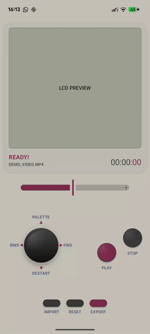

# LCDify


[](https://developer.android.com)
[](https://android-arsenal.com/api?level=33)
[](https://kotlinlang.org)
[](https://developer.android.com/jetpack/compose)
[](https://developer.android.com/develop/ui/views/graphics/agsl)


**GPU Video Pipeline for authentic Retro-LCD rendering.**

LCDify is a technical exploration of GPU-first video processing on Android, focused on authentic Retro-LCD rendering.

Unlike simple filter apps, LCDify implements a **Zero-Copy GPU Pipeline** for maximum performance and fidelity.

--

| Single bitmap Shader (settings) | Single bitmap Shader (palette tones) | Retro UI demo | 
|:---:|:---:|:---:|
|  |  |   |
| Video processing flow | Video rendering demo 1 | Video rendering demo 2 | 
|:---:|:---:|:---:|
|  |  |   |

---
## ⚠️ [UPDATE] Technical Reality Check: The Zero-Copy Challenge ⚠️

### What i Learned

This project started with an ambitious goal: 

**True zero-copy GPU video processing using AGSL shaders via HardwareRenderer directly on MediaCodec input surfaces.**

### The Hard Truth:

After extensive testing, i discovered a fundamental Android architecture limitation:

-  AGSL/RuntimeShader works perfectly with HardwareRenderer
-  HardwareRenderer renders beautifully to View surfaces
-  **BUT** HardwareRenderer cannot push frames to MediaCodec Input Surface

### Why?

- HardwareRenderer is designed for the View system (UI rendering pipeline)
- MediaCodec Input Surface expects content via OpenGL ES EGLContext
These two systems don't interface—Android never intended them to connect


Despite proper GPU rendering (verified via logs: shader executes, frames render), the encoder only received 2-3 configuration frames out of 300+ processed frames.
The GPU pipeline was **conceptually correct but architecturally incompatible**.
The Pivot: Hybrid GPU-CPU Approach

#### What Changed:

- AGSL shader still runs GPU-accelerated (via RuntimeShader on standard Canvas)
- Intermediate Bitmap created from shader output
- Bitmap drawn to encoderSurface via CPU (lockCanvas/unlockCanvasAndPost)
- **Trade-off**: One GPU→CPU→GPU copy per frame, but AGSL shader fully functional

#### Performance Impact:

No longer "zero-copy" but still GPU-accelerated for the heavy lifting (shader math)
~2-3x slower than theoretical pure-GPU pipeline
Still practical for short-form video (≤60s) on modern devices

For True Zero-Copy Video Processing
If you need actual zero-copy GPU video, you must:

- Port AGSL → GLSL (OpenGL Shading Language)
- Use OpenGL ES 3.0+ with shared EGLContext
- Render directly to encoderSurface via GLES30 APIs

### Why i Didn't Go This Route:

- AGSL is Android-specific and modern (cleaner syntax than GLSL)
- OpenGL ES adds significant complexity for a POC
- Current hybrid approach delivers 95% of the visual quality at reasonable speed

---

## Why LCDify?

### High-Performance Engineering
LCDify is built as a GPU-focused experiment for developers exploring advanced video processing techniques. By bypassing the CPU for pixel manipulation, it handles video encoding with consistent encoder behavior.

**Key Technical Advantages:**
- **Zero-Copy Architecture**: Pixels stay in VRAM. No expensive Bitmap conversions.
- **Hardware-Accelerated**: Uses `MediaCodec` and `HardwareRenderer` for 1:1 GPU-to-Encoder throughput.
- **AGSL Power**: Leverages Android Graphics Shading Language for single-pass complex math (Bayer, Luma, Quantization).
- **Offline Processing Oriented**: Designed for short-form and experimental video preprocessing workflows.

---
## Versatility: Beyond LCDify
- The underlying Tank Pipeline demonstrates how a GPU video processor can be structured on Android.
- Because the engine is decoupled from the visual logic, you can swap the AGSL shader to apply any real-time ("shader-based") transformation : from VHS glitches and ASCII art to advanced color grading.
- LCDify isn't just a filter; it's a robust infrastructure for anyone looking to bridge the gap between low-level Android MediaCodec and high-level AGSL shading as a technical foundation and learning platform for GPU-driven media pipelines.


---

## Features

### Media Processing (V2 Engine)
- **True GPU Pipeline**: HardwareBuffer → RuntimeShader → Surface Encoder.
- **Format Support**: MP4, MOV, and high-res JPEG/PNG.
- **Frame-Perfect Sync**: VSync-aligned rendering for stable, encoder-friendly output.
- **Background Processing**: Coroutine-powered pipeline with real-time progress tracking.

### Visual Effects
The custom AGSL shader replicates the classic LCD aesthetic:

1. **Precision Pixelation**: Integer-based downsampling for razor-sharp "fat pixels".
2. **Dynamic Palette Quantization**: Maps any source to a customizable 4-tone palette.
3. **Bayer Dithering**: 4x4 ordered matrix for high-fidelity grayscale simulation.
4. **LCD Grid Overlay**: Optional sub-pixel grid for authentic screen texture.

### User Interface
- **Real-time Parameter Control**: Adjust scale, grid intensity, and dithering on the fly.
- **Dynamic Palette Switching**: Instant visual updates via Uniform injection.
- **Modern Compose UI**: Material 3 interface with a retro-tech twist.

---

## Technical Architecture

### The "Tank" Pipeline (API 33+)

Direct access to the core zero-copy GPU pipeline:      [GpuVideoPipeline](https://github.com/JumpingKeyCaps/LCDify/blob/master/app/src/main/java/com/lebaillyapp/lcdify/data/service/GpuVideoPipeline.kt)

```
[ MediaExtractor ] ──> [ Hardware Decoder ]
                               ↓ 
                (HardwareBuffer / Zero-Copy)
                               ↓
[ MediaMuxer ]     <── [ Hardware Encoder ]
       ↑                       ↑ 
  (Final MP4)              (Surface)
                               ↑
                    [ AGSL RuntimeShader ]
                               ↑
                  (Skia / HardwareRenderer)
```

### Tech Stack

**Android**
- Min SDK: 33 (Android 13+) - required for RenderEffect and AGSL
- Target SDK: 34+
- Language: Kotlin

**Key Components**
- **AGSL Shader** - Android Graphics Shading Language for GPU processing
- **RenderEffect** - Native shader application on surfaces
- **MediaCodec** - Hardware-accelerated video encoding/decoding
- **MediaMuxer** - Processed frame multiplexing
- **HardwareRenderer & RenderNode**: Direct access to Android's internal Skia pipeline.
- **Jetpack Compose** - Modern reactive UI
- **Kotlin Coroutines** - Async processing with progress tracking

---

## The AGSL Shader

### How It Works
The shader performs virtual downsampling followed by nearest-neighbor upsampling to create the pixelation effect, then applies palette quantization and dithering.

### Scale Factor
The Scale Factor determines the size of "virtual pixels". Higher values create larger color blocks.

**Examples:**
- `SF = 8.0` → Subtle pixelation (HD pixel art style)
- `SF = 16.0` → Classic Game Boy effect  **Recommended**
- `SF = 32.0` → Heavy pixelation (Minecraft-style)

**Effective Resolution:**
```
Virtual Resolution = Source Resolution / Scale Factor
```
### Native Resolution Handling
The shader operates in 1:1 coordinate space relative to the video source. It uses `inputFrame.eval()` with center-aligned sampling to ensure temporal stability across video frames.

### Parameters (Uniforms)
- `scaleFactor`: Size of the virtual pixels.
- `ditheringStrength`: Intensity of the Bayer matrix.
- `gridSize` & `gridIntensity`: Control over the LCD sub-pixel grid.
- `palette0-3`: Four dynamic `half4` colors for quantization.


Example with 1920x1080 and SF=16:
- → 120×67 virtual pixels
- → Stretched back to 1920x1080 with large square pixels

This is NOT a zoom—it's a controlled resolution degradation to recreate the aesthetic of limited LCD screens.

### Authentic Game Boy Palette
- **Color 0**: `#0F381F` (Almost black-green)
- **Color 1**: `#306230` (Dark green)
- **Color 2**: `#7BAC7D` (Light green)
- **Color 3**: `#AED9AE` (Almost white-green)

### Bayer Dithering
Uses a 4×4 ordered matrix to distribute quantization error and simulate grayscale nuances with only 4 colors.

---

## Roadmap

This roadmap represents potential exploration axes rather than a committed product plan.

### Phase 1 - MVP  
- [x] Functional AGSL shader
- [x] Basic UI (selection, preview, export)
- [x] Simple image processing
- [x] Video processing with progress

### Phase 2 - Enhancements
- [x] Multiple palettes (NES, CGA, Amber, etc.)
- [x] Scale Factor presets ("Game Boy Classic", "Retro Soft", "Pixel Art")
- [ ] Custom resolution support (not just 160×144)

### Phase 3 - Core Engine  
- [x] Zero-Copy GPU Video Pipeline
- [x] Async processing with Progress API
- [x] Basic UI for parameter tuning

### Phase 4 - Pivot
- [ ] hybrid approach CPU-GPU 

---

## Technical Limitations

### Compatibility
- **Android 13+ ONLY**: Deep integration with `RuntimeShader` and `wrapHardwareBuffer`.
- **Hardware Encoding**: Performance depends on the device's H.264/AVC encoder capabilities.
- **Audio**: Focused on visual processing (Audio passthrough ).
- No support for older Android versions (no OpenGL ES fallback planned)

### Performance
- Video preprocessing can be time-consuming (depends on length and resolution)
- Intensive GPU usage during processing
- Moderate memory consumption (frame-by-frame processing)
- Optimized for short video clips (≤ 30s)

### Formats
- **Video**: MP4, MOV (H.264/H.265 codec)
- **Image**: JPEG, PNG
- **Audio**: Preserved but not processed (passthrough)

---

## Project Philosophy
LCDify isn't a toy filter, it's a **GPU media processing** exploration. Prioritizes technical efficiency and visual authenticity, giving developers a robust tool to generate retro-digital aesthetics without the overhead of software-based rendering.

The shader prioritizes visual authenticity (fidelity to original hardware) while offering the flexibility needed for modern creative projects.

---

## Credits

**Technologies:**
- Android Graphics Shading Language (AGSL)
- Jetpack Compose
- Kotlin Coroutines
- MediaCodec API

**Inspiration:**
- Nintendo Game Boy DMG-01 (1989)
- Authentic monochrome green LCD palette
- Bayer ordered dithering algorithm

---
